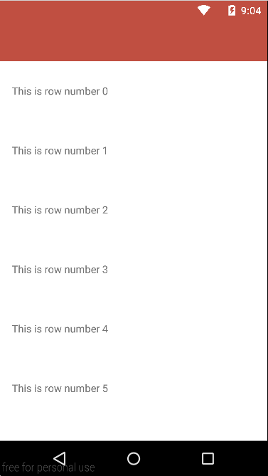

android-swipe-to-dismiss-undo-in-both-directions
=============================

Library to make the items in a `ListView` or `RecyclerView` dismissable with the possibility to undo
it into two directions, using your own view to provide this functionality like the Gmail app for Android does.

Add the following to your `build.gradle`:

    repositories {
		maven { url "https://jitpack.io" }
	}

	dependencies {
		compile 'com.github.michaelmuenzer:android-swipe-to-dismiss-undo:v1.0.3'
	}

Create a Layout
===============

To make an item in the list dismissable, you need to place a ViewGroup (i.e. FrameLayout) as the 
root view of your item layout. Inside the ViewGroup, add one view that contains the main content for 
the row (your primary layout when the row hasn't been dismissed yet) and another view that contains 
the contents of the dismiss layout (i.e. with an undo button).

Finally, just set the `tag` XML attribute on the two ViewGroups that you are using to display - `dataContainer` for your "front" view, and `leftUndoContainer`, `rightUndoContainer` for the "back" views

For example, the following layout uses a FrameLayout with two child views: a TextView to contain 
the main content (populated by an Adapter at runtime), and a LinearLayout for the undo layout.

    <?xml version="1.0" encoding="utf-8"?>
    <FrameLayout
        xmlns:android="http://schemas.android.com/apk/res/android"
        android:layout_width="match_parent"
        android:layout_height="wrap_content"
        android:id="@+id/lyt_container"
        android:background="@color/gray_background">

        <TextView
            android:layout_width="match_parent"
            android:layout_height="wrap_content"
            android:height="@dimen/list_item_height"
            android:gravity="center_vertical"
            android:paddingLeft="@dimen/list_item_padding_sides"
            android:paddingRight="@dimen/list_item_padding_sides"
            android:id="@+id/txt_data"
            android:background="@android:color/white
            android:tag="dataContainer"/>

        <LinearLayout
            android:layout_width="match_parent"
            android:layout_height="match_parent"
            android:orientation="horizontal"
            android:visibility="gone"
            android:weightSum="3"
            android:height="@dimen/list_item_height"
            android:paddingLeft="@dimen/list_item_padding_sides"
            android:paddingRight="@dimen/list_item_padding_sides"
            android:tag="leftUndoContainer">

            <TextView
                android:layout_width="0dp"
                android:layout_height="match_parent"
                android:id="@+id/txt_delete"
                android:gravity="center_vertical"
                android:text="@string/deleted"
                android:clickable="false"
                android:layout_weight="2"
                android:hapticFeedbackEnabled="true"
                android:textColor="@android:color/white"/>

            <TextView
                android:layout_width="0dp"
                android:layout_height="match_parent"
                android:gravity="center"
                android:id="@+id/txt_undo"
                android:text="@string/undo"
                android:clickable="false"
                android:layout_weight="1"
                android:textColor="@color/yellow"/>

            </LinearLayout>

    </FrameLayout>

NOTE that the second child in the layout (here the LinearLayout), must have the visibility set to
GONE, or both the data and the undo layout will be displayed in the row at the same time.

Usage
==============

With a `ListView`:

<pre><code>
final SwipeToDismissTouchListener<ListViewAdapter> touchListener =
                new SwipeToDismissTouchListener<>(
                        new ListViewAdapter(listView),
                        new SwipeToDismissTouchListener.DismissCallbacks<ListViewAdapter>() {
                            @Override
                            public boolean canDismiss(int position) {
                                return true;
                            }

                            @Override
                            public void onPendingDismiss(SomeCollectionView recyclerView, int position, SwipeToDismissTouchListener.SwipeDirection direction) {
                            }

                            @Override
                            public void onDismiss(ListViewAdapter view, int position, SwipeDirection direction) {
                                adapter.remove(position);
                            }
                        });
listView.setOnTouchListener(touchListener);
listView.setOnScrollListener((AbsListView.OnScrollListener) touchListener.makeScrollListener());
listView.setOnItemClickListener(new AdapterView.OnItemClickListener() {
    @Override
    public void onItemClick(AdapterView<?> parent, View view, int position, long id) {
        if (touchListener.existPendingDismisses()) {
            touchListener.undoPendingDismiss();
        } else {
            Toast.makeText(ListViewActivity.this, "Position " + position, LENGTH_SHORT).show();
        }
    }
});
</code></pre>

With a `RecyclerView`:

<pre><code>
final SwipeToDismissTouchListener<RecyclerViewAdapter> touchListener =
                new SwipeToDismissTouchListener<>(
                        new RecyclerViewAdapter(recyclerView),
                        new SwipeToDismissTouchListener.DismissCallbacks<RecyclerViewAdapter>() {
                            @Override
                            public boolean canDismiss(int position) {
                                return true;
                            }

                            @Override
                            public void onPendingDismiss(SomeCollectionView recyclerView, int position, SwipeToDismissTouchListener.SwipeDirection direction) {
                            }

                            @Override
                            public void onDismiss(ListViewAdapter view, int position, SwipeDirection direction) {
                                adapter.remove(position);
                            }
                        });

recyclerView.setOnTouchListener(touchListener);
recyclerView.setOnScrollListener((RecyclerView.OnScrollListener)touchListener.makeScrollListener());
recyclerView.addOnItemTouchListener(new SwipeableItemClickListener(this,
        new OnItemClickListener() {
            @Override
            public void onItemClick(View view, int position) {
                if (view.getId() == R.id.txt_delete) {
                    touchListener.processPendingDismisses();
                } else if (view.getId() == R.id.txt_undo) {
                    touchListener.undoPendingDismiss();
                } else { // R.id.txt_data
                    Toast.makeText(context, "Position " + position, LENGTH_SHORT).show();
                }
            }
        }));
</code></pre>

Special Thanks
==============

Romman Nurik for the initial contribution with [swipe to dismiss](https://github.com/romannurik/Android-SwipeToDismiss) for `ListView`. As well I want to thank hudomju for the undo extension in [android-swipe-to-dismiss-undo](https://github.com/hudomju/android-swipe-to-dismiss-undo) 